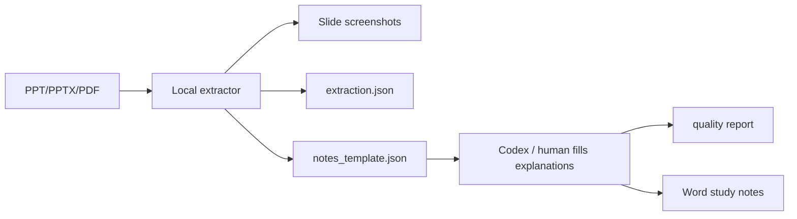

# Summarize PPT Notes

Turn lecture slides into structured Word study notes with slide screenshots, extracted text, formulas, images, chart metadata, and per-slide teaching explanations.

This repository is both a Codex Skill and a local extraction toolkit. The Skill tells Codex how to reason over each page; the CLI handles deterministic file work such as rendering slides, extracting images, producing JSON templates, and building `.docx` output.

## Why It Exists

Most PPT summarizers stop at short bullet summaries. This project targets serious courseware and technical presentations where the useful output must include:

- full-page slide screenshots
- text, notes, tables, images, charts, and formula candidates
- explanations of what each slide is for
- detailed walkthroughs for dense diagrams, derivations, algorithms, and equations
- worked examples for complex formulas
- a quality report that flags missing explanations before delivery

## Features

- Supports `.pptx`, `.ppt`, and slide `.pdf`
- Renders full-slide screenshots through LibreOffice + PyMuPDF
- Extracts PowerPoint XML text, speaker notes, tables, images, chart/diagram relationships, and formula-like expressions
- Generates `extraction.json`, `notes_template.json`, `extraction.md`, `quality_report.json`, and `quality_report.md`
- Generates final notes as Markdown plus an LLM/VLM prompt pack for review workflows
- Generates a final-exam study pack: cram plan, active-recall questions, formula sheet, Anki CSV, mistake-log template, one-page review, and Mermaid concept map
- Builds a Word `.docx` with slide screenshots and structured notes
- Can run as a Codex Skill or as a standalone CLI
- Works offline for extraction; no source files are uploaded by the scripts

## Quick Start

```bash
python3 scripts/doctor.py
python3 scripts/ppt_notes_exporter.py "slides.pptx" --output "PPT学习笔记.docx"
```

The first run creates a work directory beside the Word file:

```text
PPT学习笔记_work/
├── assets/
├── converted/
├── screenshots/
├── study_pack/
├── extraction.json
├── extraction.md
├── notes_template.json
├── quality_report.json
└── quality_report.md
```

Fill `notes_template.json` with slide explanations, then rebuild the final Word document:

```bash
python3 scripts/ppt_notes_exporter.py "slides.pptx" \
  --notes-json "PPT学习笔记_work/notes_template.json" \
  --output "PPT学习笔记.docx" \
  --notes-markdown "PPT学习笔记_work/final_notes.md" \
  --prompt-pack "PPT学习笔记_work/prompt_pack.md" \
  --exam-date 2026-06-20 \
  --study-mode final \
  --layout study \
  --output-profile teacher \
  --fail-under 85
```

## Use As A Codex Skill

Copy or keep this folder as a skill directory:

```bash
mkdir -p ~/.codex/skills
cp -R summarize-ppt-notes ~/.codex/skills/
```

Then ask Codex:

```text
Use $summarize-ppt-notes to turn this PPT into a full Word study-notes document.
```

## CLI Options

```bash
python3 scripts/ppt_notes_exporter.py "slides.pptx" \
  --slides 1,3-5 \
  --max-slides 10 \
  --dpi 180 \
  --output notes.docx \
  --workdir notes_work \
  --notes-json notes_filled.json \
  --fail-under 90
```

Useful modes:

- `--template-only`: generate extraction files without building DOCX
- `--no-render`: skip LibreOffice/PDF rendering for fast XML-only extraction
- `--slides 1,3-5`: export only selected slides
- `--fail-under 90`: fail the process if note coverage is below the threshold
- `--notes-markdown`: write final notes as Markdown for GitHub preview or review
- `--prompt-pack`: write a slide-by-slide prompt pack for another model or human reviewer
- `--study-mode final`: require final-exam fields in the quality report
- `--layout study`: polished review handout; `--layout audit` includes full raw extraction for debugging
- `--output-profile teacher`: default clean output; creates `*_deliverables/START_HERE.md`
- `--output-profile complete`: clean output plus all artifact paths
- `--output-profile debug`: print raw artifact paths without packaging a clean student folder
- `--study-pack-dir`: choose where the final-exam review pack is written
- `--exam-date`: generate a cram plan relative to a target exam date

## What Students Should Open

The default teacher profile creates a clean `*_deliverables/` folder. Open this first:

```text
*_deliverables/
├── START_HERE.md
├── 01_复习讲义.docx
├── 02_完整讲义.md
├── 03_一页纸总览.md
├── 04_主动回忆题.md
├── 05_公式速查.md
├── 06_错题本模板.md
└── 可选_Anki卡片.csv
```

Students should start from `START_HERE.md`. The work directory contains debug files and should not be the first thing a learner opens.

## Final-Exam Study Pack

The generated `study_pack/` folder is designed for students who need to convert lecture slides into an actual review loop:

- `README.md`: dashboard and file map
- `exam_cram_plan.md`: day-by-day review plan
- `one_page_review.md`: high-yield summary
- `active_recall_questions.md` and `.json`: closed-book self-test questions
- `formula_sheet.md`: formulas, meanings, conditions, and examples
- `flashcards_anki.csv`: importable flashcards
- `flashcards.md`: readable flashcards
- `mistake_log_template.md`: error notebook template
- `concept_map.mmd`: Mermaid concept map

See [docs/FINAL_EXAM_WORKFLOW.md](docs/FINAL_EXAM_WORKFLOW.md) for the recommended review method.
See [docs/OUTPUT_QUALITY.md](docs/OUTPUT_QUALITY.md) for the anti-fluff writing standard used by the quality gate.

## Dependencies

Required:

- Python 3.9+

Recommended for full output:

- LibreOffice, for PPT/PPTX/PPT to PDF rendering
- PyMuPDF, for PDF text extraction and screenshots
- Pillow, for accurate image sizing inside Word output

Install Python extras for local development:

```bash
python3 -m pip install --upgrade pip setuptools
python3 -m pip install -e ".[dev,render]"
```

On macOS, LibreOffice can be installed from the official app package or through Homebrew.

## Architecture



## Comparison

This project is intentionally narrower than general document converters. See [docs/COMPARISON.md](docs/COMPARISON.md) for the current positioning against MarkItDown, pptx2md, Unstructured, and Docling.

## Commercial Direction

The open-source core should stay excellent at local extraction, document generation, and quality gates. Commercial layers can build on top without locking basic usage:

- hosted batch processing
- OCR/math recognition service for screenshot-only equations
- template branding and school/company styles
- paid model backends for automatic slide explanation
- team workspace, history, and review workflow

That gives the project a clean open-core story: local, inspectable, privacy-respecting extraction remains free; high-volume automation and advanced recognition can become paid products.

See [docs/PRODUCT_STRATEGY.md](docs/PRODUCT_STRATEGY.md) for target users, packaging, paid tiers, and roadmap.

## Privacy

The included scripts process files locally. They do not call external APIs. If you connect Codex or another model to fill the generated notes, review that model provider's data policy before sending private courseware or company decks.

## Roadmap

- OCR plugin hook for formulas embedded only in screenshots
- OMML-to-LaTeX conversion for Office Math objects
- branded Word templates
- PowerPoint comment export
- richer chart data extraction
- web UI for reviewing slide explanations before DOCX generation

## License

MIT. See [LICENSE](LICENSE).
